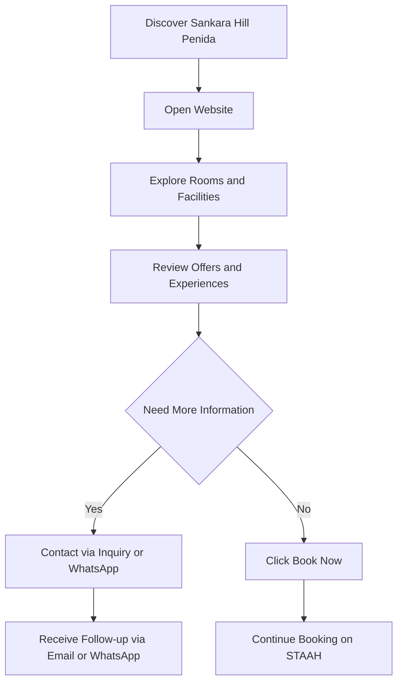
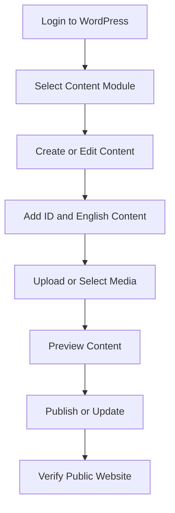
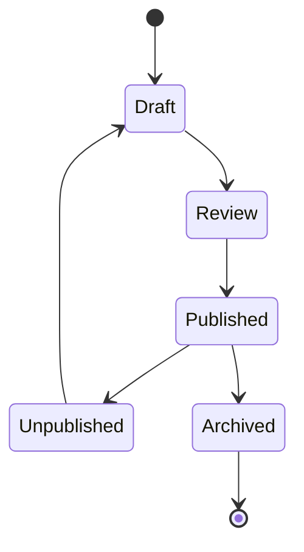
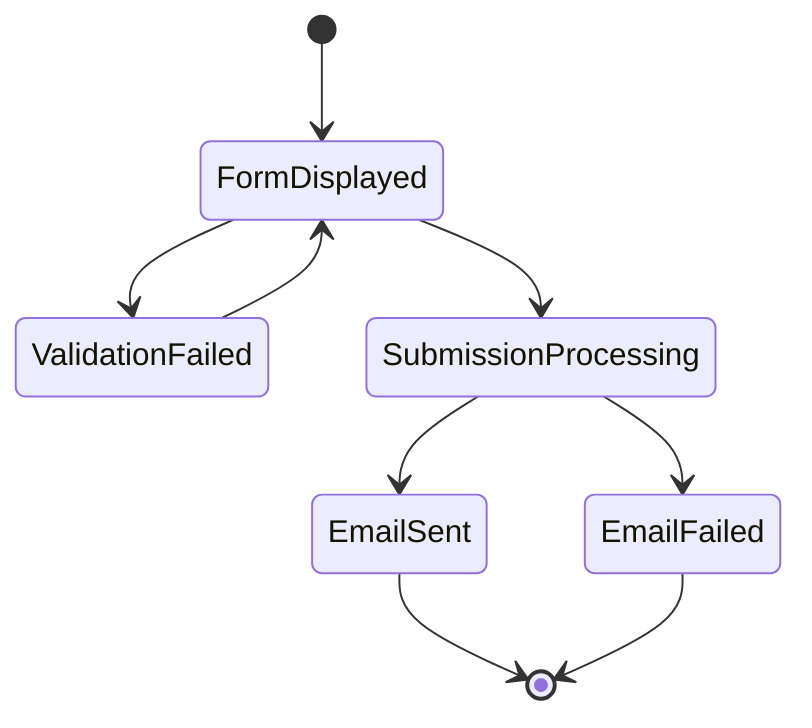
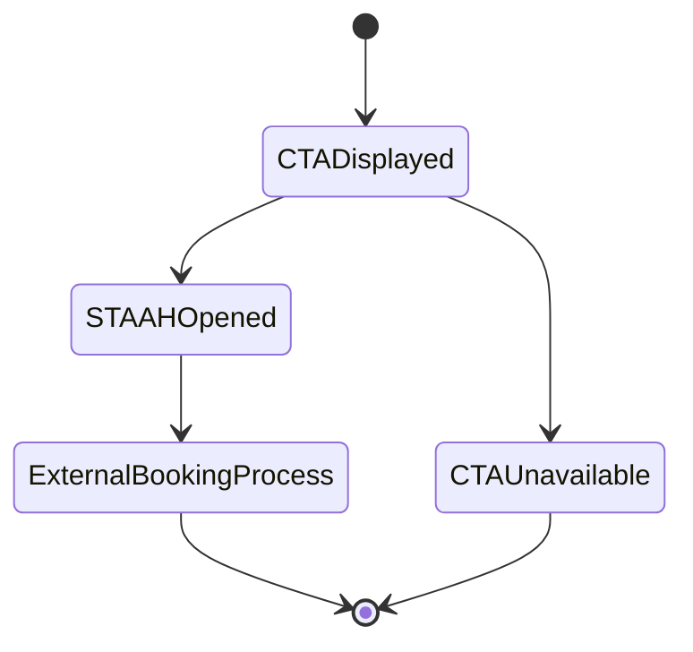

# Sankara Hill Penida Website Company Profile Development — Product Requirements Document

## 1. Personas

### 1.1 Prospective Guest

Visitor yang mencari informasi akomodasi, fasilitas, pengalaman, promo, dan opsi booking Sankara Hill Penida.

**Goals:**
- Memahami nilai dan fasilitas properti.
- Menemukan room yang sesuai.
- Melihat promo dan pengalaman wisata.
- Menghubungi properti.
- Melanjutkan booking melalui STAAH.

### 1.2 Website Visitor

Pengunjung umum yang ingin membaca artikel, melihat gallery, testimonial, menu restaurant, spa, atau informasi lokasi.

**Goals:**
- Menemukan informasi dengan cepat.
- Menggunakan website dalam Bahasa Indonesia atau English.
- Mengakses WhatsApp, email inquiry, atau Google Maps.

### 1.3 WordPress Content Administrator

Admin yang mengelola seluruh konten website melalui WordPress.

**Goals:**
- Membuat dan memperbarui konten.
- Mengelola konten ID-EN menggunakan Polylang.
- Mengelola media, promo, room, blog, FAQ, testimonial, dan CTA.
- Memperbarui booking URL STAAH dan informasi kontak.

### 1.4 Property Management Team

Tim pengelola properti yang menyediakan konten, informasi operasional, booking URL, SMTP, WhatsApp, dan Google Maps.

**Goals:**
- Menjaga informasi website tetap akurat.
- Menerima inquiry visitor melalui email.
- Mengarahkan calon tamu ke STAAH.

## 2. Persona Journey Diagrams

### 2.1 Prospective Guest Journey

### 2.2 Content Administrator Journey

## 3. Entity State Diagrams

### 3.1 Content Entity

### 3.2 Inquiry Entity

### 3.3 Booking CTA

## 4. User Stories (Persona-First)

### 4.1 Prospective Guest

- Sebagai prospective guest, saya ingin melihat hero section yang menarik agar memahami positioning Sankara Hill Penida.
- Sebagai prospective guest, saya ingin melihat room dan amenities agar dapat memilih akomodasi.
- Sebagai prospective guest, saya ingin melihat promo agar menemukan penawaran yang relevan.
- Sebagai prospective guest, saya ingin melihat experiences agar memahami aktivitas yang tersedia.
- Sebagai prospective guest, saya ingin menggunakan Bahasa Indonesia atau English agar mudah memahami informasi.
- Sebagai prospective guest, saya ingin menekan Book Now agar dapat melanjutkan booking di STAAH.
- Sebagai prospective guest, saya ingin mengirim inquiry melalui form agar dapat meminta informasi tambahan.
- Sebagai prospective guest, saya ingin menghubungi properti melalui WhatsApp agar memperoleh jalur komunikasi cepat.
- Sebagai prospective guest, saya ingin melihat Google Maps agar dapat mengetahui lokasi properti.

### 4.2 Website Visitor

- Sebagai website visitor, saya ingin membaca About Us agar memahami properti dan brand.
- Sebagai website visitor, saya ingin melihat restaurant menu dan spa treatments agar dapat merencanakan pengalaman selama menginap.
- Sebagai website visitor, saya ingin melihat gallery dan testimonial agar memperoleh gambaran nyata tentang properti.
- Sebagai website visitor, saya ingin membaca blog/article agar mendapatkan informasi tambahan.
- Sebagai website visitor, saya ingin menggunakan navigasi yang konsisten agar mudah berpindah halaman.

### 4.3 WordPress Content Administrator

- Sebagai admin, saya ingin mengelola seluruh jenis konten melalui WordPress agar tidak bergantung pada developer untuk perubahan rutin.
- Sebagai admin, saya ingin mengelola konten ID-EN melalui Polylang agar kedua bahasa tetap tersedia.
- Sebagai admin, saya ingin mengelola image dan video melalui Media Library agar aset website terorganisir.
- Sebagai admin, saya ingin mengelola room, promo, gallery, testimonial, FAQ, menu, dan article agar informasi publik selalu mutakhir.
- Sebagai admin, saya ingin memperbarui STAAH URL, WhatsApp, email, dan Google Maps agar CTA menggunakan data terbaru.
- Sebagai admin, saya ingin publish atau unpublish konten agar hanya informasi yang disetujui tampil di website.

### 4.4 Property Management Team

- Sebagai property management team, saya ingin menerima inquiry melalui email agar dapat menindaklanjuti calon tamu.
- Sebagai property management team, saya ingin booking dialihkan ke STAAH agar proses reservation tetap menggunakan sistem operasional yang tersedia.
- Sebagai property management team, saya ingin memperbarui konten dan promo agar website mencerminkan kondisi bisnis terkini.

## 5. Acceptance Criteria

### 5.1 Navigation and Language

- Website memiliki navigasi menuju seluruh halaman In Scope.
- Navigasi berfungsi pada desktop, tablet, dan mobile.
- Language switcher menampilkan Bahasa Indonesia dan English.
- Konten bahasa yang dipilih tampil konsisten pada halaman yang tersedia.
- Tidak ada link navigasi utama yang mengarah ke halaman kosong atau error.

### 5.2 Home Page

- Hero banner atau video/image slider tampil dengan benar.
- Section accommodation, promotion, experiences, facilities, gallery, testimonials, dan FAQ tersedia.
- CTA Book Now mengarah ke STAAH.
- Setiap section menampilkan empty state yang layak jika konten belum tersedia.

### 5.3 Accommodation and Booking

- Visitor dapat melihat daftar room.
- Visitor dapat membuka detail room.
- Detail room menampilkan amenities dan media yang tersedia.
- Booking CTA mengarah ke STAAH URL yang dikonfigurasi.
- Website tidak menyimpan availability, reservation, atau payment data.
- Link STAAH dapat dibuka pada tujuan eksternal yang ditentukan.

### 5.4 Restaurant, Spa, and Experiences

- Restaurant menampilkan overview, menu, dining experience, gallery, dan CTA.
- Spa menampilkan overview, treatments, packages, gallery, dan CTA.
- Experiences menampilkan snorkeling, island tour, local activities, dan konten experience lain.
- Seluruh konten dapat dikelola admin dan tersedia dalam bahasa yang dikonfigurasi.

### 5.5 Offers, Blog, Gallery, Testimonials, and FAQ

- Admin dapat membuat, mengubah, publish, dan unpublish promo.
- Visitor dapat melihat promo list dan detail yang tersedia.
- Blog memiliki listing dan detail article.
- Gallery menampilkan media yang dipublish.
- Testimonials berasal dari input manual WordPress.
- FAQ dapat ditampilkan dalam format yang mudah dibaca.
- Konten mendukung ID-EN melalui Polylang.

### 5.6 Inquiry Form

- Form memiliki field wajib yang terdokumentasi.
- Format email divalidasi.
- Input divalidasi di browser dan server.
- Inquiry valid dikirim melalui SMTP client ke email penerima.
- Success message tampil setelah pengiriman berhasil.
- Error message tampil jika validasi atau pengiriman gagal.
- SMTP credentials tidak terlihat pada frontend.
- Form dilindungi dari submission tidak valid dan request tanpa otorisasi.

### 5.7 Contact, WhatsApp, and Google Maps

- Contact page menampilkan alamat dan contact information.
- WhatsApp floating button menggunakan nomor yang disediakan client.
- Google Maps menampilkan lokasi atau membuka map link yang disediakan client.
- Link kontak dapat digunakan pada perangkat mobile.

### 5.8 WordPress CMS

- Admin dapat CRUD seluruh content type yang termasuk scope.
- Admin dapat mengelola media.
- Admin dapat mengisi versi ID dan English.
- Admin dapat memperbarui global booking URL, contact data, WhatsApp, dan map data.
- Konten draft tidak tampil pada website publik.
- Konten unpublished tidak tampil pada listing publik.

### 5.9 Responsive, Accessibility, and SEO

- Layout usable pada desktop, tablet, dan mobile.
- Image memiliki alt text field.
- Form memiliki label dan error message yang jelas.
- Interactive element memiliki visible focus state.
- Heading hierarchy konsisten.
- Halaman memiliki URL readable dan metadata dasar.
- Halaman multilingual memiliki language metadata yang benar.

## 6. Edge Cases & Unhappy Paths

| Scenario | Expected Behavior |
|---|---|
| STAAH URL kosong | CTA disembunyikan atau menampilkan fallback yang dikonfigurasi; halaman tidak rusak |
| STAAH sedang tidak tersedia | Visitor tetap melihat website; kegagalan ditangani oleh STAAH |
| SMTP gagal mengirim | Tampilkan error message; jangan tampilkan success message |
| Field inquiry kosong | Tampilkan validasi pada field terkait |
| Format email invalid | Tolak submission dan tampilkan instruksi perbaikan |
| Visitor submit berulang kali | Cegah atau minimalkan duplicate submission |
| Konten hanya tersedia dalam satu bahasa | Tampilkan bahasa yang tersedia tanpa translation palsu |
| Tidak ada promo aktif | Tampilkan empty state yang informatif |
| Tidak ada room aktif | Tampilkan fallback content atau pesan ketersediaan informasi |
| Image gagal dimuat | Tampilkan fallback image atau layout yang tetap usable |
| Video gagal dimuat | Tampilkan fallback image atau hero content |
| Gallery kosong | Sembunyikan gallery section atau tampilkan empty state |
| FAQ kosong | Sembunyikan FAQ section atau tampilkan empty state |
| Google Maps gagal dimuat | Tampilkan address dan map link alternatif |
| WhatsApp number tidak dikonfigurasi | Sembunyikan floating button |
| Konten memiliki translation tidak lengkap | Tampilkan konten bahasa aktif yang tersedia dan jangan menampilkan placeholder |
| Admin menyimpan draft | Draft tidak tampil pada website publik |
| Media terlalu besar | WordPress menolak atau memberi peringatan sesuai batas upload hosting |
| Pengguna mengakses URL tidak ditemukan | Tampilkan halaman 404 yang memiliki navigasi kembali |
| Plugin eksternal gagal | Halaman inti tetap dapat dirender sejauh tidak bergantung pada plugin tersebut |

## 7. UX Flow Walkthroughs

### 7.1 Explore and Book

1. Visitor membuka Home.
2. Visitor melihat hero dan highlight utama.
3. Visitor membuka Accommodation.
4. Visitor memilih room category.
5. Visitor membaca detail dan amenities.
6. Visitor menekan Book Now.
7. Website membuka STAAH.
8. Visitor menyelesaikan proses booking pada STAAH.

### 7.2 Submit Inquiry

1. Visitor membuka Contact Us.
2. Visitor memilih bahasa.
3. Visitor mengisi field inquiry.
4. Visitor menekan Submit.
5. Sistem memvalidasi input.
6. Jika invalid, sistem menampilkan error pada field terkait.
7. Jika valid, sistem mengirim email melalui SMTP.
8. Sistem menampilkan success atau error state.

### 7.3 Manage New Promotion

1. Admin login ke WordPress.
2. Admin membuka menu Offers/Promotions.
3. Admin membuat promo baru.
4. Admin mengisi konten Bahasa Indonesia.
5. Admin mengisi konten English melalui Polylang.
6. Admin menambahkan gambar, periode, dan CTA bila diperlukan.
7. Admin preview konten.
8. Admin publish.
9. Promo tampil pada listing dan section terkait.

### 7.4 Update Booking URL

1. Admin login ke WordPress.
2. Admin membuka global settings.
3. Admin mengganti STAAH booking URL.
4. Admin menyimpan perubahan.
5. Admin menguji CTA Book Now dari Home dan Accommodation.
6. Seluruh CTA menggunakan URL terbaru.

## 8. Tech Stack Summary

| Area | Requirement |
|---|---|
| CMS | WordPress |
| Theme | Custom atau configured WordPress theme |
| Backend | WordPress/PHP |
| Database | MySQL atau MariaDB |
| Multilingual | Polylang |
| Email | SMTP client |
| Booking | Redirect ke STAAH |
| Map | Google Maps embed atau link |
| Messaging | WhatsApp deep link |
| Hosting | Client-provided WordPress hosting |
| Content | WordPress CMS dan Media Library |
| Responsive | Desktop, tablet, mobile |
| Security | HTTPS, nonce, sanitization, escaping, controlled updates |

## 9. Out of Scope

- Native booking engine.
- Room availability synchronization.
- Reservation management di WordPress.
- Online payment.
- Payment gateway.
- Automatic Google Reviews atau Tripadvisor integration.
- Hosting procurement.
- Advanced SEO module.
- Separate admin/editor role setup.
- Automated content translation.
- CRM integration.
- Marketing automation.
- Newsletter system.
- Loyalty or membership system.
- Client content production, photography, videography, dan translation service.
- Pengelolaan operasional booking setelah visitor masuk ke STAAH.

### Deferred Baseline

- **Admin/editor role separation:** menggunakan role WordPress standar; owner keputusan dan konfigurasi lanjutan: client.
- **Advanced global SEO settings:** baseline SEO metadata dan indexable structure; advanced SEO configuration: client.
- **Social link management:** baseline dapat memakai field/theme configuration; dedicated management module: client.

## 10. Definition of Done

### Product and Content

- Seluruh halaman dan modul In Scope tersedia.
- Konten ID-EN dapat dikelola melalui Polylang.
- Konten contoh atau final dari client telah dimasukkan sesuai scope.
- Tidak ada placeholder yang tampil pada production.
- Booking URL, email penerima, SMTP, WhatsApp, dan Google Maps telah dikonfigurasi.

### Functional

- Navigasi dan language switcher berfungsi.
- Room, restaurant, spa, experiences, offers, blog, gallery, testimonial, dan FAQ berfungsi.
- Semua booking CTA mengarah ke STAAH.
- Inquiry form tervalidasi dan berhasil mengirim email melalui SMTP.
- WhatsApp dan Google Maps dapat digunakan.
- Draft dan unpublished content tidak tampil publik.
- Empty, loading, validation, success, error, dan 404 states tersedia sesuai kebutuhan.

### Quality

- Responsive test selesai pada desktop, tablet, dan mobile.
- Browser compatibility test selesai pada browser utama.
- Accessibility checks dasar selesai.
- Basic SEO checks selesai.
- Image dan media telah dioptimalkan.
- Tidak ada broken link kritis.
- Tidak ada error JavaScript/PHP kritis pada production.

### Security and Operations

- HTTPS aktif.
- Form memiliki server-side validation dan nonce protection.
- Input disanitasi dan output di-escape.
- SMTP credentials tidak terekspos.
- Admin credentials diserahkan secara aman.
- Backup dan update procedure mengikuti kemampuan hosting client.
- Dokumentasi penggunaan WordPress CMS diserahkan.

### Approval

- Client melakukan UAT.
- Temuan kritis telah diselesaikan.
- Client menyetujui konten dan tampilan.
- Website siap dipublikasikan pada hosting client.